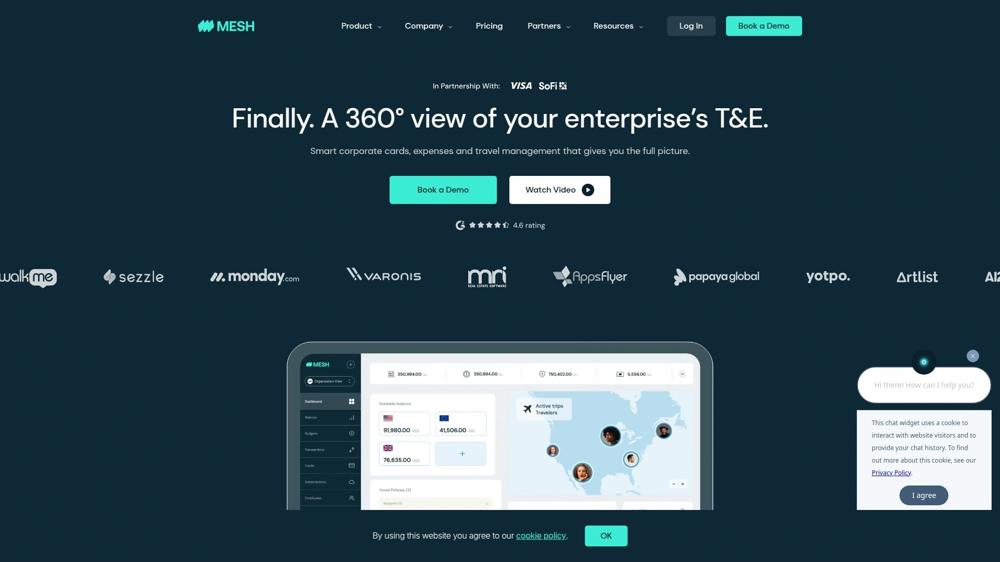

# 2025年排名前18的企业支出管理平台汇总(近期更新)

企业花钱杂、对账慢、预算看不清，是很多财务团队的日常。这里挑出18个企业支出管理平台，覆盖公司卡、费用报销、应付自动化等核心场景。你可以预期更可控的预算、更快的对账、更透明的多币种成本，部署门槛低，上线速度快。

## [Aspire](https://aspireapp.com)
一体化支出管理与公司卡平台

- 模块齐全：企业账户、多币种账户与外汇、公司卡(实体/虚拟)、费用报销、账单支付与应付自动化。
- 强控费：预算与审批流、商户/类别限额、实时风控与提醒，支出透明。
- 集成能力：对接主流会计/ERP与报销系统，自动同步凭证与科目。
- 体验：在线开户与KYC，东南亚本地化支付覆盖友好，多币种场景更顺手。
- 适合谁：跨境电商、互联网、代理/服务型团队及成长型企业。
- 推荐理由：一套工具打通公司卡与AP/报销，减少系统切换与对账压力。

## [Ramp](https://ramp.com)
自动化与节省导向公司卡平台

- 特色：自动识别重复订阅与异常花费，给出节省建议；强大的报表与商户洞察。
- 功能：虚拟/实体卡、收据自动匹配、账单管理、采购与预算策略。
- 集成：主流会计、Slack与身份系统，落地快。
- 适合：追求效率与成本优化的科技/成长型公司。

## [Brex](https://www.brex.com)
高增长企业用的全球卡与支出管理

- 支撑多实体、多团队预算；差旅与费用一体，手机端报销体验流畅。
- 强项：实时预算、类别策略、自动凭证；对新创与高速成长企业友好。
- 套餐分层，适配从小团队到规模化组织。

## [Airbase](https://www.airbase.com)
统一AP与卡与报销工作台

- 一个入口覆盖公司卡、账单/采购、报销；审批从申请到支付全链路可追踪。
- 优势：细粒度权限、供应商管理、审计级凭证留存。
- 适合：希望把应付自动化与企业支出管理收敛到同一平台的财务团队。

## [Payhawk](https://payhawk.com)
欧洲覆盖强的一体化支出平台

- 功能：公司卡、发票识别、AP自动化、报销、预算与多实体合并报表。
- 卖点：适配跨国团队与多币种结算，移动端好用。
- 对中大型、在欧运营企业较友好。

## [Spendesk](https://www.spendesk.com)
中小企业友好的费用控制平台

- 预先预算+公司卡，减少垫付；发票处理与对账自动化。
- 可视化资金流，审批链简单明了。
- 上手门槛低，适合SaaS、代理与电商团队。

## [Pleo](https://www.pleo.io)
简洁易用的公司卡与报销平台

- 体验取向：报销拍照即录、虚拟卡即开即用、团队预算一目了然。
- 支持发票与订阅管理，减少手工对账。
- 适合强调易用性的中小企业。

## [Navan](https://navan.com)
企业级差旅与报销一体化平台

- 把差旅预订、出差政策和费用报销放到同一套流程。
- 动态策略控制、实时票价与预算对齐，减少超标报销。
- 差旅频繁的团队收益明显。

## [BILL Spend & Expense](https://www.bill.com/solutions/spend-management)
中端市场常用的支出方案平台

- 前身Divvy，卡与预算深度绑定；账单与报销统一视图。
- 与BILL的应付产品组合，改善从采购到支付的协同。
- 适合北美中小与中端市场客户。

## [Yokoy](https://www.yokoy.io)
AI驱动的全球支出管理平台

- 发票/收据AI识别、异常检测、自动记账建议。
- 面向多国多实体的集团化场景，合规策略灵活。
- 适合中大型组织。

## [Soldo](https://www.soldo.com)
欧洲企业多卡控费方案平台

- 预付/公司卡、钱包分配与预算；实时交易提醒与限额。
- 发票匹配、费用分类自动化，简化财务月结。
- 适合市场/项目制团队多、卡需求大的公司。

## [Mesh Payments](https://www.meshpayments.com)
科技公司偏爱的卡控与报销平台

- 为SaaS订阅与线上采购优化：按商户/项目开虚拟卡，避免混刷。
- 可视化订阅台账、自动对账；异常消费即时阻断。
- 适合工程与产品团队预算分散的企业。

## [Emburse](https://www.emburse.com)
从报销到发票的全栈套件平台

- 旗下多产品覆盖差旅、报销、发票与支付，灵活组合。
- 优势：合规政策内置、审计追踪、移动端体验成熟。
- 适合希望渐进式升级的财务团队。

## [Expensify](https://www.expensify.com)
报销自动化与企业卡一体平台

- SmartScan识别发票，规则引擎自动审批；企业卡对账自动配对。
- 从报销切入做企业支出管理，简单好上手。
- 适合轻量化起步，逐步扩展功能。

## [Zoho Expense](https://www.zoho.com/expense)
轻量级报销与差旅管理平台

- 报销、差旅与审批流标准化；对接Zoho生态更顺滑。
- 价格友好，适合预算敏感型中小企业或初创团队。

## [Volopay](https://www.volopay.com)
东南亚新创常用的卡控平台

- 公司卡、账单支付、供应商付款与报销；多实体管理。
- 上线流程简洁，适合跨区域团队与东南亚本地运营。
- 支持常见会计系统对接。

## [Jeeves](https://www.tryjeeves.com)
多币种信用卡与支出管理平台

- 面向全球化新创：多币种额度、虚拟卡、预算与限额策略。
- 对跨境SaaS/电商团队较友好，开卡与日常管理顺畅。

## [Spenmo](https://spenmo.com)
AP自动化与卡与报销方案平台

- 东南亚定位明显：供应商付款、账单审批、公司卡与报销统一管理。
- 提升从请款到支付的效率，减少人工作业。
- 适合区域性团队与本地化结算需求强的企业。

### 常见问题

- 企业支出管理平台怎么快速上线？
  - 先梳理预算/审批与报销口径，优先开通虚拟卡与报销；随后对接会计科目与银行，对历史订阅开独立卡。

- 如何衡量选型成效？
  - 看月结关账天数、收据匹配率、超标/异常支出下降比例、报销时效与人工录入减少量。

- 是否支持多实体/多币种与应付自动化？
  - 大多数平台支持，重点核对多实体报表合并、外汇费率透明度、发票/账单的自动化程度与本地支付覆盖。

### 总结

以上18个平台覆盖公司卡、费用报销、应付自动化、多币种账户等关键能力，能让预算更可控、对账更省时。为什么 [Aspire](https://aspireapp.com) 适合东南亚跨境与多币种支出场景：它把公司卡、AP与多币种账户放在同一平台，部署快、覆盖本地支付、成本结构清晰。选一套贴近你业务版图的工具，财务效率就能稳步提升。
